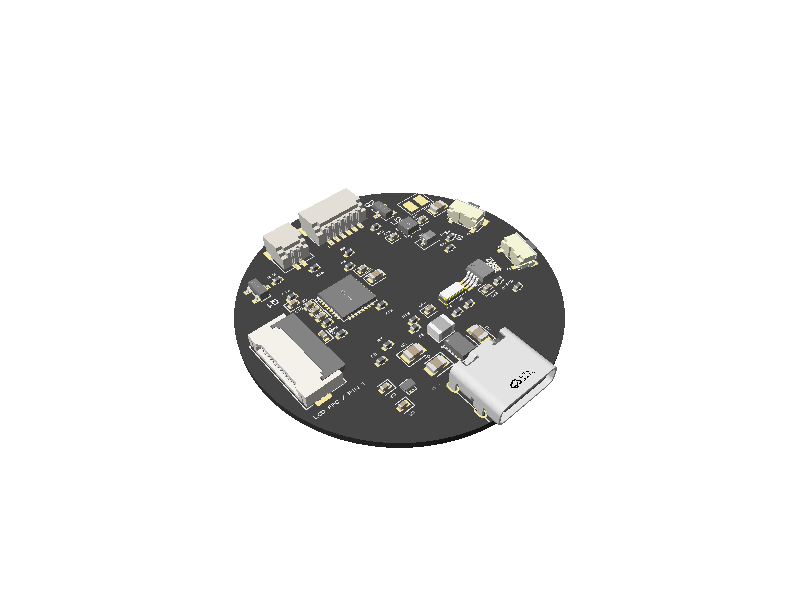

# SMARTWATCH V1 — STM32L432 Health & Fitness Watch Hardware

> A compact 40 mm round smartwatch PCB with a 240 x 240 color display, motion tracking, accurate battery-backed timekeeping, vibration alerts, USB-C charging, and a protected 400 mAh LiPo battery.

SMARTWATCH V1 is a standalone, non-radio wearable hardware platform built around the low-power STM32L432. It combines the display, sensors, controls, charging system, power rails, programming connector, and haptic driver required for a practical watch in one four-layer board design.

This repository contains the complete tscircuit PCB source, component models, schematic and placement snapshots, procurement BOM, and hardware documentation. It defines the **watch electronics**; application firmware and the final enclosure are separate deliverables.



_The preview shows the electronics PCB. The display panel folds over the board; the battery, enclosure, and wire-lead motor are installed separately._

## What this watch can support

- A full-color round watch interface on a 1.28-inch 240 x 240 IPS display.
- Time, date, alarm, and wake scheduling using a dedicated battery-backed RTC.
- Step counting, motion detection, and wrist-wake gestures using a BMA400 accelerometer.
- Silent vibration alerts through a MOSFET-driven coin vibration motor.
- Menu and select/back input through two physical side buttons.
- USB-C battery charging and simultaneous system operation through a charger with power-path management.
- Stable 3.3 V operation across the LiPo discharge curve using a buck-boost regulator.
- Battery-voltage measurement by the MCU for a software charge-level estimate.
- Direct firmware flashing and debugging through a keyed SWD connector.

These are hardware capabilities. Their user-facing behavior depends on the firmware, display UI, algorithms, calibration, and final enclosure.

## Hardware at a glance

| Subsystem | Part / implementation | What it provides |
| --- | --- | --- |
| Main controller | STM32L432KCU6 | 80 MHz Cortex-M4F, 256 KB flash, 64 KB SRAM |
| Display | ER-TFT1.28-3 / GC9A01A | 1.28-inch round 240 x 240 color IPS UI |
| Motion sensor | Bosch BMA400 | Steps, movement, orientation, and wake interrupts |
| Real-time clock | PCF8563TS + 32.768 kHz crystal | Accurate timekeeping, alarm, and timer interrupts |
| User controls | Two side buttons | Active-low menu and select/back inputs |
| Haptics | 10 mm coin vibration motor | Silent alerts and interaction feedback |
| Charger / power path | TI BQ25180 | Protected 1-cell LiPo charging and USB/battery power management |
| Main regulator | TI TPS63802 | Regulated 3.3 V buck-boost supply |
| Battery | Protected LP403035 1S LiPo | 3.7 V nominal, 400 mAh energy storage |
| External power | Power-only USB-C | 5 V charging input with CC resistors and VBUS TVS protection |
| Programming | Keyed 6-pin JST-SH SWD | SWDIO, SWCLK, reset, BOOT0, target reference, and ground |
| PCB | 40 mm round, 1 mm thick | Four layers and double-sided component assembly |

## Deliberately not included in V1

V1 has no Bluetooth, Wi-Fi, cellular radio, GPS, NFC, touchscreen, speaker, microphone, external flash, or dedicated fuel-gauge IC. USB-C is used for power only; its USB data pins are not connected. The watch is therefore intended as a standalone embedded platform rather than a phone-connected notification watch.

## Current project status

- Schematic, component selection, pin allocation, placement, BOM, and 3D review assets are implemented.
- The placement build and strict electrical/connectivity checks pass.
- Firmware, enclosure, flex integration, and production validation are still required.
- **The PCB copper routing is not Gerber/order-ready.** Autorouted trials still have clearance/contact violations that must be resolved before fabrication.

## Schematic organization

The electrical design is separated into five named ANSI B schematic sheets. Named nets carry power and signals between sheets while all components remain part of the same physical PCB.

| Sheet | Contents |
| --- | --- |
| 1. Power, USB-C & Charging | USB-C input, protection, LiPo charger/power path, battery connector, and 3.3 V buck-boost |
| 2. MCU, Battery Monitor & Programming | STM32L432, local decoupling, reset/BOOT0, I2C pull-ups, battery ADC divider, and SWD connector |
| 3. Display & Backlight | LCD FPC connector, display control nets, backlight current limiting, and PWM MOSFET driver |
| 4. Motion & RTC | BMA400 accelerometer, PCF8563 RTC, crystal, interrupt pull-ups, and decoupling |
| 5. Buttons & Haptics | Two side buttons, pull-ups, vibration motor, MOSFET driver, flyback diode, and local bulk capacitor |

IC symbol bodies are sized to their pin groups rather than their physical package dimensions. The motion/RTC sheet keeps local decoupling close to each compact symbol.

The design follows the older Open-Smartwatch code pattern: one main board file contains the complete board, native passives, device instances, placement, and connections. Only reusable/custom package definitions live under `imports/`; there is no `blocks/` directory or separate `components.tsx`. The root `index.circuit.tsx` exports the board. `tscircuit.config.json` selects the placement build, and `tscircuit.config.js` applies the same mode to development previews and snapshots.

## What is implemented

- STM32L432KCU6, 80 MHz Cortex-M4, 256 KB flash, 64 KB SRAM, 26 GPIO, UFQFPN-32.
- EastRising/BuyDisplay ER-TFT1.28-3 complete 1.28-inch 240 x 240 GC9A01A IPS LCD panel, selected in the no-touch configuration. Its 15-pin, 0.5 mm-pitch plug-in FPC mates with a JLC-assembled JUSHUO AFC24-S15FIA-00 connector (`J4`, `C6709462`); unused touch pins are deliberately NC.
- PCF8563TS RTC on the battery rail with an FC-135 32.768 kHz crystal. The PCF8563 has internal oscillator load capacitance; external crystal capacitors are not fitted.
- BMA400 in I2C mode at address `0x14`: CSB high, SDO low, both interrupt outputs routed.
- BQ25180 USB charger/power-path IC and TPS63802 3.3 V buck-boost regulator.
- Sink-only USB-C with independent 5.1 kΩ CC1/CC2 pull-downs, grounded shell, and VBUS TVS protection. USB data pins are NC.
- Two side buttons using the old board's exact C51927172 footprint and pin map, a keyed 6-pin JST-SH SWD/programming connector, battery-voltage ADC divider, PWM LCD backlight, and MOSFET-driven coin vibration motor with flyback diode. The STM32 buttons are active-low with 100 kΩ external pull-ups: switch pin 1 goes to the GPIO, pin 2 goes to GND, and the two bracket/retention pads remain electrically unconnected.

## Power tree

```text
USB-C 5 V ──> BQ25180 IN ──> SYS ──> TPS63802 ──> 3V3
                      └────> BAT <── protected 1S LiPo
3V3 ─────────────────> MCU, display, BMA400
BAT ─────────────────> PCF8563 and MCU battery ADC divider
```

`SYS` is not used directly as the digital rail because it can exceed 3.3 V while USB is attached. TPS63802 uses 510 kΩ/91 kΩ feedback resistors: `0.5 V × (1 + 510/91) ≈ 3.30 V`.

## MCU resource check and pin map

The selected MCU is sufficient for this V1. A 240 x 240 RGB565 full framebuffer consumes 115,200 bytes, so it does not fit in 64 KB SRAM; firmware must render by lines/tiles or draw directly into the GC9A01 GRAM. Program flash (256 KB), one SPI bus, one I2C bus, ADC, timers/PWM, and the allocated GPIO are otherwise adequate.

| STM32 pin       | Function                             |
| --------------- | ------------------------------------ |
| PA0 / PA1       | Buttons 1 / 2                        |
| PA2             | Motor enable PWM/GPIO                |
| PA3             | BQ25180 interrupt                    |
| PA4 / PA5 / PA7 | LCD CS / SCK / MOSI                  |
| PA6             | Battery ADC (1 MΩ / 330 kΩ divider)  |
| PA8 / PA9       | BMA400 INT1 / INT2                   |
| PA10            | RTC interrupt                        |
| PA11            | Unused (NC)                         |
| PA13 / PA14     | SWDIO / SWCLK                        |
| PA15            | LCD backlight PWM                    |
| PB0 / PB1       | LCD D/C / reset                      |
| PB6 / PB7       | Shared I2C SCL / SDA                 |
| PH3             | BOOT0, 100 kΩ pull-down and J3       |

The MCU uses its internal high-speed oscillator; the only external crystal is the RTC crystal.

## Programming connector

`J3` replaces the six loose programming test pads with a keyed JST `SM06B-SRSS-TB(LF)(SN)` side-entry connector (`C160405`). Its cable pinout is custom and must not be confused with the ARM 10-pin Cortex-Debug pinout.

| J3 pin | Signal | Programmer connection                    |
| -----: | ------ | ---------------------------------------- |
|      1 | 3V3    | Target-voltage reference; do not backfeed |
|      2 | SWDIO  | SWD bidirectional data                   |
|      3 | GND    | Common ground                            |
|      4 | SWCLK  | SWD clock                                |
|      5 | NRST   | Target reset                             |
|      6 | BOOT0  | Optional boot-mode control               |

Use the matching JST `SHR-06V-S` cable housing with `SSH-003T-P0.2-H` crimp contacts. Normal flashing only needs 3V3 reference, SWDIO, GND, SWCLK, and NRST; leave BOOT0 low unless the ROM bootloader is intentionally required.

## Firmware requirements

At first boot, firmware must configure BQ25180 for the qualified pack. For the listed 400 mAh pack, use a conservative 100–150 mA charge current, 4.20 V regulation, and an appropriate USB input current limit. The charger starts in a low default charge-current state until configured over I2C.

Use STOP mode, BMA400 interrupts, RTC alarm interrupt, and display/backlight shutdown for practical battery life. The BMA400, PCF8563, and BQ25180 share I2C; the display has a dedicated SPI bus.

## Mechanical and safety constraints

- The PCB diameter is 40 mm (reduced from 50 mm, a 36% reduction in board area), with four layers and double-sided assembly. This is the PCB size, not a validated enclosure diameter. The USB-C receptacle is top-mounted at the lower edge; its mouth opens through the case sidewall. J2, J3, J4 and both side switches are also on the top/display side. All pads retain the 0.2 mm board-edge clearance; no component uses `allowOffBoard`.
- `J4` is mounted on the top at the left side of the circular PCB. Insert the ER-TFT1.28-3 flex with its pin 1 aligned to the PCB pin-1 marker, lock the hinged lid, and fold the panel over the electronics PCB. The external LCD outline is intentionally not drawn as FR-4, so the placement render stays circular.
- The ER-TFT1.28-3 flex folds around the top-side connector. Validate contact orientation, pin-1 alignment, bend radius and connector access in an enclosure model. The listed rectangular battery, display, connector heights, case wall and cover still require a complete mechanical fit check; a 40 mm PCB alone does not establish a 40 mm finished watch.
- Keep the BMA400 away from the motor and mechanically isolate the motor where possible. Recalibrate step algorithms in the final case.
- Only use a protected, qualified 1S 4.20 V LiPo. The selected LP403035 pack has PCM protection but no NTC. R3=10 kΩ is the BQ25180 datasheet's fixed-TS option; it disables real pack-temperature monitoring. A production wearable should use a qualified NTC pack/connector revision and must pass charging, thermal, drop, sweat, and enclosure testing.
- Verify battery-connector polarity on every incoming lot. The listed battery needs a correctly polarized JST-SH pigtail/custom lead.

## Assembly status

The SMT BOM is JLCPCB-oriented. `LCD1` is the deliberate exception: order exact panel `ER-TFT1.28-3` directly from BuyDisplay in the **no-touch** configuration and install its flex after SMT assembly. JLCPCB can assemble `J4` (`AFC24-S15FIA-00`, `C6709462`), but its listing requires an assembly support fixture. `M1` is a wire-lead motor and is normally attached after SMT assembly. `BT1` is external.

Current inventory is recorded in [bom.csv](./bom.csv). The display, display connector, and programming connector were checked on 2026-08-27; stock changes continuously, so re-run the JLCPCB BOM tool before ordering.

## 3D CAD preview

The [bottom-layer preview](./__snapshots__/SMARTWATCH_V1_STM32.circuit-bottom.snap.svg) shows the remaining bottom-side components. Regenerate it with `npx tsci snapshot SMARTWATCH_V1_STM32.circuit.tsx --update --layer bottom --disable-parts-engine`.

Exact EasyEDA/JLCPCB OBJ and STEP model metadata is attached for J1–J4, U1–U2, U5–U6, L1, Y1, Q1–Q2, and SW1–SW2. The side switches face the right case wall with rotations of 104° and 76°; their placement anchors are x = 16.1 mm, y = ±4.5 mm. Their pad bounds and courtyards pass placement checks without an off-board exemption. These models are served by the tscircuit model CDN, so an offline or blocked-CDN session will still show placeholders.

`M1` deliberately remains a PCB connection-pad representation rather than a board-mounted CAD body. The VC1026B002F is a wire-lead, adhesive-backed external motor that is mounted to the enclosure or a qualified keepout location, not centered on its two solder pads. Vybronics supplies its 3D CAD only on request; adding a motor body at the pad coordinates would misrepresent the mechanical assembly.

## Build and verification

```sh
cd /Users/manishchaudhary/repo/ts/SMARTWATCH_V1_STM32
npm install
npm run typecheck
npm test
npm run dev
npm run snapshot:update
npm run build:routed
```

`build`, `build:placement`, `test`, `dev`, and the checked-in snapshots intentionally use the routing-disabled configuration. This makes the schematic, component placement, source connectivity, and custom MOSFET pin mapping deterministic and reviewable. `test` also rejects every Circuit JSON warning/error, unexpected open pin, merged named net, or incorrect Q1/Q2 gate-source-drain connection. It checks generated pad associations, the shared I2C connections, unused PA11, connector placement and the 40 mm round board. The custom MOSFET symbol explicitly maps SOT-23 pins 1/2/3 to gate/source/drain; the default symbol uses a different numbering and must not be substituted without remapping.

`build:routed` sets `SMARTWATCH_ROUTED=1` and bypasses the default build setting, gives the local capacity router five minutes, and checks both DRC diagnostics and copper coverage of every named net. The explicit runtime flag is required because the installed CLI also reads the runtime configuration during `--ignore-config`. The 2026-09-06 run on the previous placement reached exact-geometry refinement but timed out after 318.6 seconds with the five-minute limit. No complete routed result was validated. A passing placement test does not establish copper continuity or routed clearances. The source and snapshots are suitable for schematic and placement review, but the copper is **not Gerber/order-ready**. Freeze or manually complete a route, clear every routed DRC item, then inspect the generated Gerbers in JLCDFM before ordering.

## Files

- `SMARTWATCH_V1_STM32.circuit.tsx` — complete board, functional sections, passives, placement, and interconnect.
- `index.circuit.tsx` — standard `tsci init` entry point exporting the smartwatch board.
- `package.json`, `tsconfig.json`, `tscircuit.config.json`, `tscircuit.config.js`, `.npmrc` — standalone project configuration.
- `scripts/check-connectivity.mjs` — strict electrical and mechanical regression checks on generated Circuit JSON.
- `imports/` — verified reusable/custom package and pin definitions, including the copied old-watch switch footprint.
- `bom.csv` — complete procurement BOM.
- `REFERENCES.md` — project commits, official datasheets, and sourcing links.
- `__snapshots__/` — deterministic routing-disabled PCB, schematic, and 3D review artifacts. Add a separately identified routed snapshot only after routed DRC is clean.
